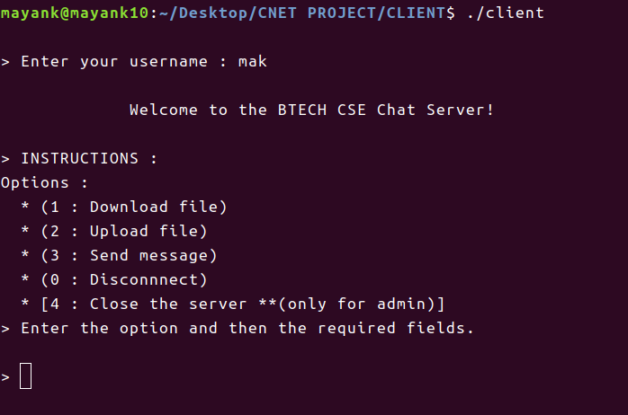

## _Computer Networks lab (CSC15206 : 2019:20) project_

# **Chat-server (using socket programming)**
It is a basic chat server programmed to handle multiple users (clients) using socket programming. You can download / upload files from / to the server and send messaages through the server to other connected clients.  
In a multi-client chat server, N clients are connected to a server and send messages. In this program, one of the clients send messages to the server and it(server) will sent back the messages to all other connected clients(we can say broadcast). The code is implemented using C language, with a TCP connection.  


## SERVER
### Working :
* In the server program, first is the establishment of connection to a port(socket creation and binding) using **socket()** and **bind()** functions. 
* Server listens for incoming connections using **listen()** function as well as keep reading from the connections it already have connected to. Server accepts incoming connections using **accept()** function, sends a welcome message to the client and recieves option(what client wants to actually do) and username from every connection using **send()/recv()** functions respectively.
* **select()** function gives the power to monitor several sockets at the same time. It tells which ones are ready for reading, which are ready for writing, and which sockets have raised exceptions.
```C
int select(int numfds, fd_set *readfds, fd_set *writefds, fd_set *exceptfds, struct timeval *timeout);
```
* Description of select() :
  * Select command allows to monitor multiple file descriptors, waiting until one of the file descriptors become active.
For example, if there is some data to be read on one of the sockets select will provide that information.
  * Select works like an interrupt handler, which gets activated as soon as any file descriptor sends any data.
  * If we want to see if we can read from standard input and some socket descriptor, sockfd, just add the file descriptors 0 and sockfd to the set readfds. The parameter numfds should be set to the values of the highest file descriptor plus one. 
  * When select() returns, readfds will be modified to reflect which of the file descriptors we selected which is ready for reading. 
  
* After select(), it run through the existing connections looking for data to read. If we got one, new connections are handled and the new file descriptor is added to the master set by keeping track of the maximum file descriptor. If there is no need to handle new connection, handle data from a client. 

### Functionalities provided :   
The server provides 3 functionalities to its users :  
1. Download file from the server - **sendFile()** function in **server-sendfile.h** is called.
2. Upload file to the server - **getFile()** function in **server-getfile.h** is called.
3. Send message to other connected clients to the server - **send_recv_msg()** function in **server-message.h** is called.

Also a client can : 
1. Disconnect from server - Connection of client with the server is terminated using **close()**.
2. Close the server (if the client is the ADMIN CLINET) - All the connected clients to the server are disconnected first and then the server is closed using **close()** function and he **exit()**.

  
  _Image showing functionalities provided at the client side by server_  

### Server Log :  
* File _"server_log.txt"_ keeps record of all the activities like starting/closing of the server, connecting/disconnecting of clients, downloads/uploads of files by the users and errors occured if any.  
* File operations are used to log (append) the information to the file after each process.


## CLIENT
### Working :  
* In the client program, first is prompt to enter the username that will be used during communication and creation of the client socket descriptor using **socket()** function.
* Second is the establishment of connection to the server and running on the localhost. Connection is established by using **connect()** function. 
* Then **select()** function is used for either reading or writing as in the server program. It sends message to the server from the keyboard input using stdin. If there is data in the recv_buf, it receives data using recv().
* Now if the socket in readfds is not '0' then it means we have to recieve  message from server and print it to stdout which can be done by calling **send_recv_msg()** function in **client-channel-selector.h** else the client is prompted for options and the option and username is sent to the server and relevant data is recieved from the server by calling **send_recv()** function in **client-channel-selector.h**. The channel selector selects the process as per the option input by the client.

### Functionalities available:  
Every client is provided with 4 + 1* options options :
1. "1" : Download file from server - **getFile()** function in **client-getfile.h** is called
2. "2" : Upload file to server - **sendFile()** function in **client-sendFile.h** is called
3. "3" : Send message to other connected clients - **send_recv_msg()** function in **client-message.h** is called
4. "0" : Disconnect from server - client socket is closed using **close()** function at server side and then **exit()** at client side.

5.* "4" : Close the server - **(ONLY FOR A ADMIN CLIENT)** - An ADMIN client can use option "4" to close the server. For doing so ADMIN client is prompted for a password if his username is stored as a ADMIN client username. If the password matches with the password stored at server then all the connected clients to server are disconnected with a message and the server is closed. 

The specifications of options available are:-
#### "1". Download file
   The user is asked to input the name of the file to be downloaded from the server. If the file exists at the server the file is transferred otherwise an no transfer takes place and 'No File Present' error is displayed.
   
#### "2". Upload file
   The user is asked to input the name of the file which is to be uploaded to the server. If the file does not exist at client location, the request is terminated by an error message else if :  
   * A file is already present at server with same name : Client is given two options :  
     * "0" Owerwrite the file present at server
     * "1 / any other number" Abort the upload
   * No such file exists at server : File is uploaded to the server.
   
#### "3". Send message
   The user is asked to input message. The message is sent to all the remaining connected clients(a type of broadcast).
   
#### "0". Disconnect from the server
   The user is disconnected from the server and the user leaves the chat server.
   
#### "4". Close the server
   Only an administrator which has the correct username and password can close the server for all users. To close the server for all users, server first authenticates the username. If the username matches it asks for a password. If the password is correct server gets closed for all the users otherwise an error message is displayed stating incorrect username/password.
